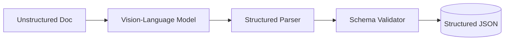

# 👁️ DeepDoc Vision Intelligence

[](https://www.python.org/downloads/)
[](https://huggingface.co/models?pipeline_tag=visual-question-answering)

**DeepDoc Vision Intelligence** is a cutting-edge framework designed to transform unstructured, complex documents into high-fidelity structured data. 

Inspired by the **"Extract"** project at **i.AI (UK Government)**, this framework leverages state-of-the-art **Vision-Language Models (VLMs)** like Florence-2, CogVLM, and GPT-4o to interpret layout, text, and visual elements simultaneously.

## 🌟 Features

- **Multimodal Extraction:** Goes beyond OCR by understanding the visual context of maps, technical drawings, and nested tables.
- **Schema-Driven Output:** Uses **Pydantic** and **Instructor** to ensure the AI output strictly adheres to a predefined JSON schema.
- **Visual Element Detection:** Automatically identifies and crops visual features (e.g., symbols on a historical map) for downstream analysis.
- **Layout Awareness:** Preserves spatial relationships between data points, crucial for historical document digitization.

## 🏗️ Architecture



## 🛠️ Installation

```bash
git clone https://github.com/gavedwards0/DeepDoc-Vision-Intelligence.git
cd DeepDoc-Vision-Intelligence
pip install -r requirements.txt
```

## 🔬 Example: Historical Map Extraction

This framework is optimized for complex tasks like converting historical planning maps into digital datasets.

```python
from src.engine import DeepDocExtractor
from src.schemas import MapElement

# Initialize extractor with a VLM (e.g., Florence-2)
extractor = DeepDocExtractor(model_id="microsoft/Florence-2-large")

# Define extraction target
query = "Identify all historical landmarks and their coordinates on this map."

# Run extraction
results = extractor.extract_structured(
    image_path="examples/data/historical_map.jpg",
    query=query,
    response_model=MapElement
)

for element in results:
    print(f"Found: {element.name} at {element.coordinates}")
```

## 🤝 Contributing
Open for collaboration on multimodal AI and document intelligence!

## 👤 Author
**Gavin Edwards**  
Principal AI Engineer @i.AI | Ex-AstraZeneca
